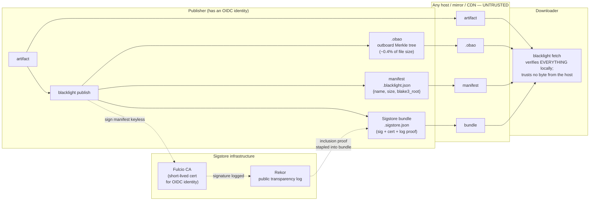
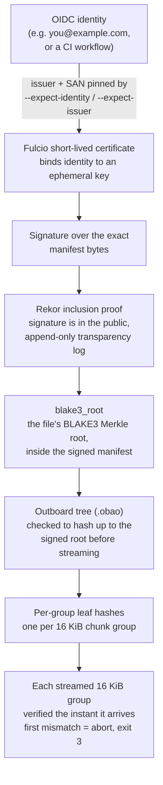
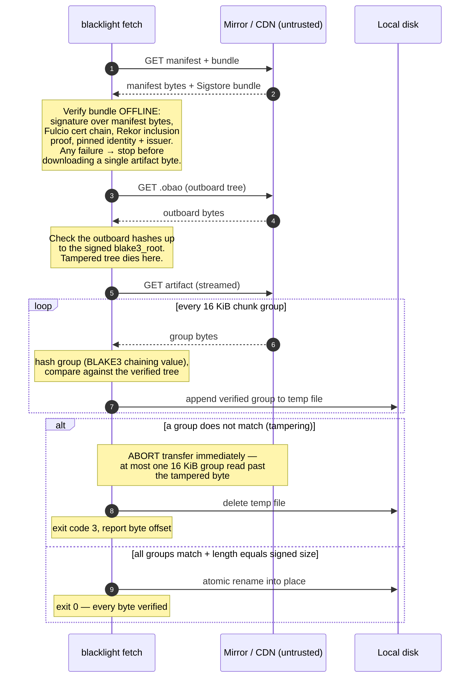

# blacklight

**Verified-streaming downloads anchored in the Sigstore transparency log —
tamper is caught mid-transfer, at the first bad byte, by a publisher you can
name.**

## Why

The folk instinct is right: *"check the hash and a hacker can't tamper with your
download."* The usual ways of doing it are not.

- **MD5 is collision-broken.** An attacker can build a malicious file that
  matches a published MD5. Even SHA-256 doesn't save you if the checksum is
  delivered the wrong way (next point).
- **An in-band checksum is replaceable by the same MITM.** If the `SHA256SUMS`
  file sits next to the artifact on the same mirror, whoever can rewrite the
  artifact can rewrite the checksum too. Both ride the same untrusted channel;
  there's no independent anchor.
- **TLS blinds the network layer instead of securing the artifact.** TLS
  authenticates *the server you reached* and encrypts the hop — but a malicious
  or compromised CDN edge or mirror serves tampered bytes over perfectly valid
  TLS, and TLS gives you no way to check what actually arrived.

So integrity has to be **end-to-end** — verified at *your* machine against an
out-of-band anchor — and the signature over the reference hash has to be
**publicly auditable**, so you can name who published it and detect a
compromised key after the fact.

blacklight does exactly that: a Sigstore-transparency-logged signature covers a
BLAKE3 Merkle root, and every 16 KiB chunk of the download is checked against
that signed root **as it streams in**.

## How it works

- **Verified streaming.** The file's BLAKE3 Merkle tree is precomputed into a
  tiny `.obao` sidecar (~0.4% overhead). On download, each 16 KiB chunk group is
  hashed and checked against the signed root the instant it arrives — the bytes
  from the untrusted mirror are never trusted, only verified.
- **Transparency-logged signature.** The root lives in a small JSON manifest,
  keyless-signed via Sigstore (OIDC → Fulcio short-lived cert → **Rekor public
  transparency log**). The client verifies the signature, cert chain, and Rekor
  inclusion proof **offline** against an embedded trusted root, and enforces the
  exact signer identity + issuer you demand *before downloading a single byte*.
- **Abort on the first bad byte.** On the first tampered chunk group, blacklight
  aborts the transfer (exit code 3), deletes the partial file, and reports the
  byte offset — having read at most one 16 KiB group past the tampering. A naive
  `curl | sha256sum` must download the *entire* file before its hash can
  mismatch.

## Architecture

### The big picture

The publisher signs once; the four resulting files can be hosted anywhere —
including hosts you assume are hostile — because the downloader verifies
everything locally:



### The trust chain

Every link is verified before the next is trusted, from a human-meaningful
identity all the way down to each 16 KiB group of bytes:



### What `fetch` actually does



## Install

```sh
cargo build --release
# binary at ./target/release/blacklight
```

Rust edition 2024 (MSRV ~1.85+).

## Quickstart

### Publish

Hash a file, build its outboard tree, write the manifest, and keyless-sign it:

```sh
# Signs via Sigstore STAGING by default (add --production for the public-good
# instance). Signing is keyless: ambient CI OIDC if present, else a browser.
blacklight publish demo.bin --url https://mirror.example.org/demo.bin
```

This produces four files to host — the artifact plus three sidecars:

```text
demo.bin                                 # the artifact (unchanged)
demo.bin.obao                            # outboard BLAKE3 Merkle tree
demo.bin.blacklight.json                 # signed manifest {root, size, geometry}
demo.bin.blacklight.json.sigstore.json   # Sigstore v0.3 bundle
```

For local testing without signing: `blacklight publish demo.bin --unsigned`
(emits only the `.obao` + manifest).

### Fetch

Download and verify, pinning *who* must have signed the root:

```sh
blacklight fetch https://mirror.example.org/demo.bin.blacklight.json \
    --expect-identity you@example.com \
    --expect-issuer https://accounts.google.com \
    -o demo.bin
```

blacklight verifies the bundle offline, enforces the identity + issuer policy
**before** touching the artifact, then streams and verifies every group. Use
`--production` to verify against the Sigstore production trust root, and
`--allow-unsigned` to skip signature verification entirely (**dangerous** — the
download is still integrity-checked against the manifest root, but nothing proves
*who* published that root).

## See it catch an attack

```sh
bash demo/run_demo.sh
```

The demo publishes a file, serves it from an honest origin, and fetches it twice:
once directly (succeeds, byte-identical) and once through a tampering MITM proxy
that flips one byte mid-stream. blacklight aborts at the first bad 16 KiB group,
leaving no output file — and it's contrasted against `curl | sha256sum`, which
must read the whole file first. Sample metrics (32 MiB file, byte flipped at
offset 16,000,000):

```text
==================  DETECTION METRICS  ==================
tampered byte offset                            16000000
total artifact size (bytes)                     33554432
blacklight: bytes consumed before               16007168
  detection (one 16 KiB group)
curl+sha256: bytes consumed before              33554432
  detection (whole file)
data blacklight avoided reading                  2.1x less
```

The tampered byte at offset 16,000,000 lands in **chunk group 976** (byte offset
15,990,784); blacklight aborts there, having verified only ~16 MB, while
`curl | sha256sum` reads all 32 MB before its hash mismatches. Measured outboard
overhead: **0.39%**. The test suite (`cargo test`) is 13 tests — 9 unit plus 4
integration that drive the real binary over a local HTTP server, including
tampered-artifact, tampered-outboard, and truncated-stream attacks.

## What it does NOT do yet

- **No rollback/freshness protection.** A validly signed *older* version replays
  cleanly — that's TUF's domain.
- **No active log monitoring.** A compromised signing identity is *detectable*
  (every signature is in Rekor) but blacklight doesn't watch the log for you.
- **Keyless signing only.** sigstore-rust 0.10 has no self-managed-key path.
- **No outboard redundancy.** A withheld `.obao` fails the fetch closed.

## Design & background

- [`docs/DESIGN.md`](docs/DESIGN.md) — full threat model, the end-to-end trust
  chain, on-disk/on-wire formats, and the `fetch` state machine.
- [`paper/PAPER.md`](paper/PAPER.md) — the write-up and motivation.

## Honesty note

Every cryptographic primitive here pre-exists and is battle-tested: BLAKE3 for
hashing and tree math, `bao-tree` (n0-computer, the engine behind iroh-blobs) for
the outboard tree, and Sigstore (Fulcio + Rekor, via sigstore-rust) for keyless
transparency-logged signatures. **blacklight's contribution is the
composition** — wiring a transparency-logged signature over a BLAKE3 root into a
forward-only, fail-fast, abort-on-first-bad-byte streaming verifier.

## License

Dual-licensed under either [MIT](LICENSE-MIT) or
[Apache-2.0](LICENSE-APACHE), at your option.
