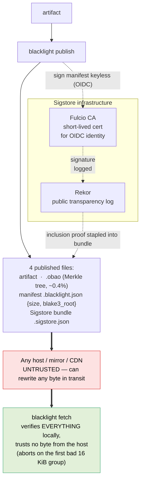
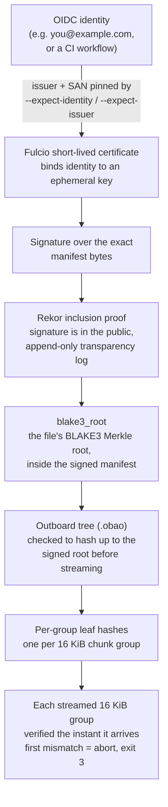
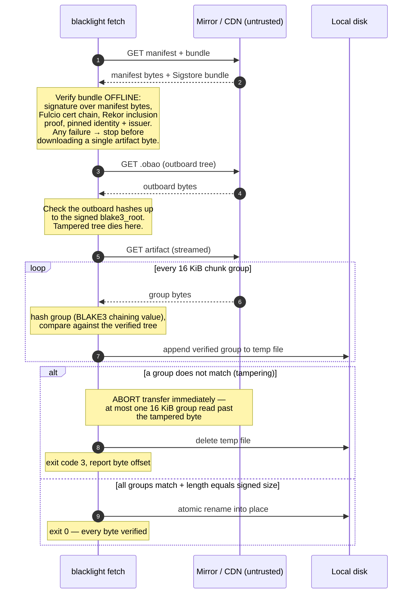

# blacklight

**Verified-streaming downloads anchored in the Sigstore transparency log —
tamper is caught mid-transfer, at the first bad byte, by a publisher you can
name.**

## Why

**The short version.** When you download a file over a network you don't
control — café WiFi, a mirror, a CDN — someone in the middle can quietly swap
the file for a tampered one. This isn't hypothetical: a host firewall flagging
unexpected connections on an untrusted network is a real experience, and
man-in-the-middle attacks on shared networks are well documented. The usual
advice is "check the file's hash so you know it wasn't tampered with." Good
instinct. But the way it's normally done doesn't actually protect you, for three
separate reasons:

> *Author's note: the author experienced unexpected network connections while at
> home during the COVID-19 pandemic and during other periods — noticed in part thanks to the [Little
> Snitch](https://www.obdev.at/products/littlesnitch/index.html) firewall. That
> experience is part of what motivated building a tool that verifies downloads
> end-to-end.*

1. **The hash people publish (MD5) is forgeable.** A "hash" is a short
   fingerprint of a file. MD5 is *collision-broken*: an attacker can craft a
   **malicious** file that has the **same** MD5 as the real one, so "the hash
   matches" no longer means "this is the real file." (This is how the [Flame
   malware](https://en.wikipedia.org/wiki/Flame_(malware)) forged a Microsoft
   code-signing certificate in 2012, using an MD5 chosen-prefix collision —
   analyzed in [Stevens, *Counter-Cryptanalysis*, CRYPTO
   2013](https://eprint.iacr.org/2013/358).)
2. **Nobody actually checks it.** Verifying a hash by hand is a manual,
   tedious step, so almost everyone skips it. Protection that depends on a
   human remembering to do a chore isn't protection.
3. **Even if you check, it's already too late.** You compute the hash *after*
   the whole file has downloaded — which means the malware is already sitting
   on your disk, and may have already been opened or auto-run before you ever
   compare fingerprints.

**blacklight fixes all three:** it uses a strong, non-forgeable hash (BLAKE3);
it verifies **automatically**, with no manual step; and it verifies the file
**as it streams in**, stopping at the very first bad byte so tampered data
never fully lands on your machine. And it proves *who* published the file, using
a signature recorded in a public, tamper-evident log.

<details>
<summary><b>The precise version</b> (for the security-minded)</summary>

The folk instinct — *"check the hash and a hacker can't tamper with your
download"* — is right. The usual realizations of it are not:

- **MD5 is collision-broken.** Collisions (two different files with the same
  hash) have been computable in seconds for years, and *chosen-prefix*
  collisions let an attacker craft a malicious file matching a benign file's
  MD5. Even SHA-256 doesn't save you if the checksum is delivered the wrong way
  (next point).
- **An in-band checksum is replaceable by the same MITM.** If the `SHA256SUMS`
  file sits next to the artifact on the same mirror, whoever can rewrite the
  artifact can rewrite the checksum too. Both ride the same untrusted channel;
  there's no independent anchor. The fix is a *signature* verifiable against a
  public key your machine already trusts.
- **TLS blinds the network layer instead of securing the artifact.** TLS
  authenticates *the server you reached* and encrypts the hop — but a malicious
  or compromised CDN edge or mirror serves tampered bytes over perfectly valid
  TLS, and TLS gives you no way to check what actually arrived.

So integrity has to be **end-to-end** — verified at *your* machine against an
out-of-band anchor — and the signature over the reference hash has to be
**publicly auditable**, so you can name who published it and detect a
compromised key after the fact.

blacklight does exactly that: a Sigstore-transparency-logged signature covers a
BLAKE3 Merkle root, and every 16 KiB chunk of the download is checked against
that signed root **as it streams in**.

</details>

## How it works

- **Verified streaming.** The file's BLAKE3 Merkle tree is precomputed into a
  tiny `.obao` sidecar (~0.4% overhead). On download, each 16 KiB chunk group is
  hashed and checked against the signed root the instant it arrives — the bytes
  from the untrusted mirror are never trusted, only verified.
- **Transparency-logged signature.** The root lives in a small JSON manifest,
  keyless-signed via Sigstore (OIDC → Fulcio short-lived cert → **Rekor public
  transparency log**). The client verifies the signature, cert chain, and Rekor
  inclusion proof **offline** against an embedded trusted root, and enforces the
  exact signer identity + issuer you demand *before downloading a single byte*.
- **Abort on the first bad byte.** On the first tampered chunk group, blacklight
  aborts the transfer (exit code 3), deletes the partial file, and reports the
  byte offset — having read at most one 16 KiB group past the tampering. A naive
  `curl | sha256sum` must download the *entire* file before its hash can
  mismatch.

## New to this? Every piece explained

If you're early in your software journey and/or some of the words above are
unfamiliar, this section is for you. Nothing here is as complicated as it sounds.

### The story, in everyday terms

Imagine a publisher wants to give you a file, but it has to travel across roads
(the internet) that thieves can tamper with. Here's the whole idea:

1. **Fingerprint the file.** The publisher runs the file through a *hash* — a
   function that turns any file into a short, unique-looking string of
   characters. Change one byte of the file and the fingerprint changes
   completely. blacklight uses a hash called **BLAKE3**.
2. **Fingerprint the pieces, not just the whole.** Instead of one fingerprint
   for the entire file, BLAKE3 internally hashes the file as a *tree* of
   fingerprints — fingerprints of small pieces, then fingerprints of those
   fingerprints, up to a single "root" fingerprint at the top. blacklight
   verifies that tree in 16 KiB pieces. This is what lets us check the file
   piece-by-piece *while it downloads*, instead of only at the very end.
3. **Sign the fingerprint so nobody can fake it.** A thief could swap the file
   *and* its fingerprint. To stop that, the publisher **signs** the root
   fingerprint — like a wax seal only they can make — and their identity (e.g.
   their email or a CI system) is baked into that seal by **Sigstore**.
4. **Write the signature in a public ledger.** The signature is recorded in
   **Rekor**, a public, append-only logbook that anyone can read and that nobody
   can secretly edit. So even if the publisher's "seal" were ever stolen, the
   theft leaves a permanent, visible trace.
5. **You verify everything on your own computer.** When you download, blacklight
   checks the seal (is this really from the publisher I named?), checks the log
   (is this signature really in the public ledger?), and then verifies each
   16 KiB piece against the signed tree *as it arrives*. The moment one piece doesn't
   match, it stops and throws the download away. The network delivered the bytes,
   but your computer is the only thing that decides whether to trust them.

### Glossary (with links to learn more)

| Term | What it means, plainly |
| --- | --- |
| **[Hash](https://en.wikipedia.org/wiki/Cryptographic_hash_function)** | A function that turns any file into a short fixed-length fingerprint. Same file → same fingerprint; change anything → totally different fingerprint. |
| **[MD5](https://en.wikipedia.org/wiki/MD5)** | An old, *broken* hash. Attackers can now make two different files share one MD5 fingerprint, so it can't be trusted for security. |
| **[BLAKE3](https://github.com/BLAKE3-team/BLAKE3)** | A modern, fast, secure hash. It's built as a *tree* internally, which is what makes streaming verification possible. blacklight uses it. |
| **[Merkle tree](https://en.wikipedia.org/wiki/Merkle_tree)** | A tree of hashes: leaves are hashes of data chunks, each parent is a hash of its children, and the single top hash (the "root") represents the whole file. Lets you verify one chunk without the whole file. |
| **Root hash** | The single fingerprint at the top of the Merkle tree. If you trust the root, and a chunk hashes correctly up to that root, the chunk is genuine. |
| **Chunk group** | blacklight verifies the file in 16 KiB pieces. Each piece is one "chunk group." Smaller pieces = catch tampering sooner; 16 KiB is a good balance. |
| **[Bao](https://github.com/oconnor663/bao) / `.obao` file** | *Bao* is the format for BLAKE3 "verified streaming." The **`.obao`** file is the *outboard* Merkle tree — all the tree's internal fingerprints stored in a small separate file (about 0.4% of the file's size) so the client can check chunks as they stream. |
| **[Sidecar file](https://en.wikipedia.org/wiki/Sidecar_file)** | A small companion file that lives next to a main file and carries extra data about it. The `.obao` tree, the manifest, and the signature are all sidecars next to your artifact. |
| **Manifest (`.blacklight.json`)** | A tiny text file (JSON) that records the file's name, size, and root hash. It's the thing that actually gets signed. |
| **[Digital signature](https://en.wikipedia.org/wiki/Digital_signature)** | Math that proves "the holder of a private key approved this data," verifiable by anyone with the matching public key. Can't be forged without the private key. |
| **[Sigstore](https://www.sigstore.dev/)** | A free system for signing software *keyless* — you sign using your existing identity (Google/GitHub/etc.) instead of managing a private key file yourself. |
| **[OIDC](https://openid.net/developers/how-connect-works/)** | "OpenID Connect" — the standard way to prove who you are with an existing account (the "Sign in with Google" flow). Sigstore uses it to tie a signature to your identity. |
| **[Fulcio](https://docs.sigstore.dev/certificate_authority/overview/)** | Sigstore's certificate authority. It takes your proven OIDC identity and issues a short-lived *certificate* saying "this key belongs to this identity, briefly." |
| **[Rekor](https://docs.sigstore.dev/logging/overview/)** | Sigstore's public **transparency log**: an append-only, tamper-evident ledger of every signature. Anyone can audit it; nobody can rewrite its history. |
| **[Transparency log](https://transparency.dev/)** | A public logbook where entries can only be added, never changed or deleted, and math proofs let anyone confirm both facts. Certificate Transparency (which protects HTTPS) works the same way. |
| **[Inclusion proof](https://transparency.dev/verifiable-data-structures/)** | A short cryptographic receipt proving "this specific entry really is in the log," checkable without downloading the whole log. |
| **[MITM (man-in-the-middle)](https://en.wikipedia.org/wiki/Man-in-the-middle_attack)** | An attacker positioned between you and a server who can read and rewrite what passes through — the exact threat blacklight defends against. |
| **[TLS / HTTPS](https://en.wikipedia.org/wiki/Transport_Layer_Security)** | Encrypts the connection to a server and confirms *which server* you reached — but it does **not** guarantee the *file* that server hands you wasn't swapped by a bad mirror or CDN. That gap is why blacklight exists. |
| **[End-to-end verification](https://en.wikipedia.org/wiki/End-to-end_principle)** | The principle that a correctness check belongs at the endpoints (your machine), not in the untrusted middle (the network). blacklight verifies on *your* computer. |
| **[CDN](https://en.wikipedia.org/wiki/Content_delivery_network)** | Content Delivery Network — servers spread worldwide that host copies of files for speed. Convenient, but you're trusting all of them not to tamper — unless you verify, which is the point here. |
| **Outboard** | Means "stored separately from the data." An *outboard* Merkle tree (the `.obao`) lives in its own file rather than being interleaved with the file's bytes. |
| **[Rust](https://www.rust-lang.org/)** | The programming language blacklight is written in — chosen for speed and memory safety, which matter for security tools. |

## Architecture

### The big picture

The publisher signs once; the four resulting files can be hosted anywhere —
including hosts you assume are hostile — because the downloader verifies
everything locally:



### The trust chain

Every link is verified before the next is trusted, from a human-meaningful
identity all the way down to each 16 KiB group of bytes:



### What `fetch` actually does



## Install

```sh
cargo build --release
# binary at ./target/release/blacklight
```

Rust edition 2024 (MSRV ~1.85+).

## Quickstart

### Publish

Hash a file, build its outboard tree, write the manifest, and keyless-sign it:

```sh
# Signs via Sigstore STAGING by default (add --production for the public-good
# instance). Signing is keyless: ambient CI OIDC if present, else a browser.
blacklight publish demo.bin --url https://mirror.example.org/demo.bin
```

This produces four files to host — the artifact plus three sidecars:

```text
demo.bin                                 # the artifact (unchanged)
demo.bin.obao                            # outboard BLAKE3 Merkle tree
demo.bin.blacklight.json                 # signed manifest {root, size, geometry}
demo.bin.blacklight.json.sigstore.json   # Sigstore v0.3 bundle
```

For local testing without signing: `blacklight publish demo.bin --unsigned`
(emits only the `.obao` + manifest).

### Fetch

Download and verify, pinning *who* must have signed the root:

```sh
blacklight fetch https://mirror.example.org/demo.bin.blacklight.json \
    --expect-identity you@example.com \
    --expect-issuer https://accounts.google.com \
    -o demo.bin
```

blacklight verifies the bundle offline, enforces the identity + issuer policy
**before** touching the artifact, then streams and verifies every group. Use
`--production` to verify against the Sigstore production trust root, and
`--allow-unsigned` to skip signature verification entirely (**dangerous** — the
download is still integrity-checked against the manifest root, but nothing proves
*who* published that root).

## Private / self-hosted Sigstore

By default blacklight uses Sigstore's public infrastructure, which logs every
signature to a **public** transparency log. Sometimes you want your own
**private** Rekor and Fulcio instead — a company distributing software over a
VPN, a nonprofit running its own infrastructure, or just someone who wants to
stand it all up locally to see how it works. In any of these cases your
artifacts are recorded in a private, auditable log rather than a public one.
blacklight supports pointing at a self-hosted Sigstore deployment: the trust
chain, the offline verification, and the identity policy are all identical —
only the endpoints and trust root change.

**Publish** against your private Rekor/Fulcio (and your own OIDC issuer, e.g.
your corporate SSO). All three endpoints must be given **together** — mixing a
private log with the public CA (or vice versa) would be an inconsistent trust
setup, so blacklight rejects a partial set:

```sh
blacklight publish demo.bin \
    --rekor-url  https://rekor.corp.internal \
    --fulcio-url https://fulcio.corp.internal \
    --oidc-url   https://sso.corp.internal/oauth
```

**Fetch** and verify against that deployment's trust root — a JSON file you
export from your Sigstore deployment's TUF root and distribute to clients (it is
the public anchor, so it is safe to hand out):

```sh
blacklight fetch https://vpn.corp.internal/demo.bin.blacklight.json \
    --trust-root ./corp-sigstore-trust-root.json \
    --expect-identity ci@corp.internal \
    --expect-issuer https://sso.corp.internal/oauth \
    -o demo.bin
```

Notes:

- Verification stays **fully offline** — the trust root plus the bundle's
  stapled inclusion proof are enough; `fetch` never contacts your Rekor at
  download time.
- `--trust-root` is required to verify private-deployment bundles (blacklight
  refuses to guess), and it conflicts with `--production` so you can't
  accidentally check a private artifact against the public root.
- See [`docs/DESIGN.md`](docs/DESIGN.md) for how the trust root is obtained and
  what each endpoint is responsible for.

### Security considerations if you host your own log

Running your own Rekor and Fulcio is a real operational responsibility, not a
config change. The public Sigstore instance is trustworthy largely because of
things a single operator does **not** automatically have — a cross-organization
TUF root, an on-call team from several companies, and independent third parties
watching the logs. When you self-host, you take those jobs on. The big ones:

- **The Fulcio CA key is now the crown jewel.** Fulcio is a certificate
  authority; whoever holds its signing key can mint a valid certificate for
  **any** identity your deployment accepts, and short-lived certs have no
  per-cert revocation — recovery is only via your TUF root. Keep the root CA key
  **offline** (hardware token) and the online signing key **non-exportable in an
  HSM/KMS**, isolated from the rest of your infrastructure.
- **A private log you don't watch proves nothing.** A transparency log's whole
  value is that a *misbehaving operator gets caught*. But a single operator can
  show different versions of the log to different clients (a "split-view" or
  fork attack), and inclusion/consistency proofs alone don't catch that. You
  must run **monitoring** ([`rekor-monitor`](https://github.com/sigstore/rekor-monitor):
  consistency-proof checking + watching for unexpected certs issued to your
  identities), and ideally add **independent witnesses** that co-sign
  checkpoints — or **dual-log** to the public Rekor so its watchers anchor you.
  As Sigstore's own guidance puts it, an unmonitored private deployment is
  "just a project without any ROI."
- **Lock down the OIDC issuer.** Fulcio trusts a valid OIDC token as proof of
  identity, so a misconfigured or compromised issuer lets an attacker get certs.
  Require the `sigstore` audience, pin the exact issuer, verify identity claims
  (e.g. `email_verified`), and enforce 2FA on human identities.
- **Protect and rotate the TUF root.** The TUF root is what distributes your
  `trust-root.json` and the **only** way to revoke a compromised Fulcio or
  Rekor. Use **threshold signing across several offline, separately-held keys**
  (never 1-of-1), with a documented rotation ceremony.
- **Also plan for:** an RFC 3161 **timestamp authority** (so short-lived certs
  stay verifiable after they expire), redundancy/DoS protection, and external,
  integrity-protected backups of the log to catch rollback.

**The honest bottom line:** a single-organization private log gives you
*internal auditability, privacy for non-public artifacts, and independence from
the public instance's availability* — genuine benefits. It does **not** give you
the public log's key property of *many independent watchers*. A private log is
only as trustworthy as the party running it; the mitigations above (independent
witnesses, third-party monitoring, dual-logging, threshold-held offline keys)
exist to buy back as much of that distributed trust as a self-hoster can. See
Sigstore's [threat model](https://docs.sigstore.dev/about/threat-model/) and
[security model](https://docs.sigstore.dev/about/security/) before you rely on a
self-hosted deployment for anything that matters.

## See it catch an attack

```sh
bash demo/run_demo.sh
```

The demo publishes a file, serves it from an honest origin, and fetches it twice:
once directly (succeeds, byte-identical) and once through a tampering MITM proxy
that flips one byte mid-stream. blacklight aborts at the first bad 16 KiB group,
leaving no output file — and it's contrasted against `curl | sha256sum`, which
must read the whole file first. Sample metrics (32 MiB file, byte flipped at
offset 16,000,000):

```text
==================  DETECTION METRICS  ==================
tampered byte offset                            16000000
total artifact size (bytes)                     33554432
blacklight: bytes consumed before               16007168
  detection (one 16 KiB group)
curl+sha256: bytes consumed before              33554432
  detection (whole file)
data blacklight avoided reading                  2.1x less
```

The tampered byte at offset 16,000,000 lands in **chunk group 976** (byte offset
15,990,784); blacklight aborts there, having verified only ~16 MB, while
`curl | sha256sum` reads all 32 MB before its hash mismatches. Measured outboard
overhead: **0.39%**. The test suite (`cargo test`) is 13 tests — 9 unit plus 4
integration that drive the real binary over a local HTTP server, including
tampered-artifact, tampered-outboard, and truncated-stream attacks.

## What it does NOT do yet

A few highlights — the **[full caveats list is in `docs/CAVEATS.md`](docs/CAVEATS.md)**,
and you should skim it before relying on blacklight for anything that matters:

- **Pre-1.0 and unaudited**, with a hand-rolled core verifier and unaudited
  streaming/Sigstore dependencies.
- **No rollback/freshness protection.** A validly signed *older* version replays
  cleanly — that's TUF's domain.
- **No active log monitoring.** A compromised signing identity is *detectable*
  (every signature is in Rekor) but blacklight doesn't watch the log for you.
- **Rekor only.** No sigsum / witnessed-log support yet — and that (not Rekor) is
  what decentralization-minded distributors tend to want. Tracked in
  [#18](https://github.com/greenrobotllc/blacklight/issues/18).
- **Keyless signing only.** sigstore-rust 0.10 has no self-managed-key path.
- **No outboard redundancy.** A withheld `.obao` fails the fetch closed.

## FAQ

### Why does one CI job (the "signed round-trip") only run on `main`, not on pull requests?

That job — `signed round-trip (Sigstore staging)` — is gated with
`if: github.event_name != 'pull_request'`, and the reason is a real GitHub
security boundary, not an oversight. The job does a *real* keyless signing
against Sigstore, which requires minting an **OIDC id-token** (`permissions:
id-token: write`). GitHub deliberately **withholds write-scoped tokens from
pull-request runs, especially from forks** — otherwise anyone who opened a PR
could mint your repo's identity token. So the job simply *cannot* sign on a PR
from a contributor's fork, and rather than have it fail confusingly there, it's
skipped on all PRs and runs on pushes to `main` (and manual `workflow_dispatch`).

The important part for a public repo: **PRs are not left unverified.** The other
jobs — `test` (build + `cargo test` + `fmt` + `clippy -D warnings` on Ubuntu and
macOS) and `attack demo` (the full tampering-proxy end-to-end) — *do* run on
every PR. Only the live-Sigstore signing round-trip waits for `main`, because
it's the one step that structurally can't run earlier. You'll see it show as
"skipped" on PRs by design.

### How is this different from npm provenance (or PyPI attestations)?

They share the *same machinery* — both use Sigstore keyless signing with a Rekor
transparency log — but they protect **different things**, and are complementary
rather than competing:

- **npm provenance / PyPI PEP 740** answer *"how and by whom was this package
  built"* — a **build-provenance** attestation (which source commit, which CI
  workflow), checked (if at all) **after** the whole artifact is downloaded, and
  only for packages published to that specific registry.
- **blacklight** answers *"do the bytes I'm downloading right now match a signed
  Merkle root from the publisher I named"* — a **transfer-integrity** layer that
  verifies **during** the download (aborting at the first bad byte), is **gated
  before** the transfer by a required signer-identity policy, and works for **any**
  artifact from **any** host, not just registry packages.

In short: provenance tells you *where an artifact came from*; blacklight makes
sure *the bytes reaching your disk are that artifact*, caught mid-stream. You'd
ideally want both — and letting blacklight also carry/verify a provenance
attestation is a
[tracked enhancement](https://github.com/greenrobotllc/blacklight/issues/25).
The honest caveat: blacklight is **not** novel in *how* it signs (that's the same
Sigstore/Rekor as npm provenance); the difference is entirely in *what* is signed
(a streaming-verifiable BLAKE3 Merkle root) and *when* it's checked (during a
gated transfer).

### Wasn't this already tried at the IETF (MICE) and abandoned?

**Short answer:** MICE only proved a download wasn't tampered with in transit —
not *who* stands behind it. blacklight ties the file to a named publisher whose
signature is recorded in a public, auditable log (using Sigstore), and refuses to
download unless that checks out.

Partly, yes — and it's worth being upfront about.

**In everyday terms first:** back in 2018 there was a proposed web standard
called MICE that did the "check each piece of a download as it arrives, stop the
moment one is wrong" part — the same streaming idea blacklight uses. It never
caught on. But think of MICE as *a tamper-evident seal on a package*: it could
tell you the package was resealed in transit, but not *who* sealed it or whether
that seal is on any public record. blacklight adds exactly that missing part — it
ties the download to a **named publisher whose signature is written in a public
logbook anyone can audit**, and it refuses to even start downloading unless that
checks out. Also, MICE didn't fail because the idea was bad; it failed because the
bigger project it was attached to got into a *political* fight between browser
makers (over who gets to control web content), and MICE went down with the ship.
That's a useful warning for blacklight, not a reason the approach is wrong.

The technical version follows.

The [Merkle Integrity Content Encoding](https://datatracker.ietf.org/doc/draft-thomson-http-mice/)
(`draft-thomson-http-mice`, expired 2019) defined an HTTP content-coding that
verified each record against a Merkle tree *as it arrived* — i.e. the same
per-chunk, abort-on-first-bad-byte **streaming** idea blacklight uses, in SHA-256.
It never became a standard. So the streaming mechanism is **not** a blacklight
invention, and we don't claim it is.

But MICE and blacklight are not the same thing, in two ways that matter:

- **MICE was only the streaming half — it checked the bytes but not the
  *source*.** Every download boils down to one short fingerprint at the top of
  its hash tree — call it the *root fingerprint*. MICE could confirm the bytes
  matched *a* root fingerprint, but said nothing about *whose* it was or whether
  anyone trustworthy stood behind it. (It existed mainly to carry content for
  **Signed HTTP Exchanges**, borrowing that project's certificates for trust.)
  blacklight adds the missing half: it **ties that root fingerprint to a named
  publisher's signature, recorded in a public logbook anyone can audit** — and it
  won't start the download unless that signature is present and comes from the
  exact publisher you asked for.

- **What killed MICE was governance, not the mechanism.** Signed HTTP Exchanges
  lost cross-vendor support — Mozilla filed a formal "harmful" position over
  centralization and origin-substitution concerns, Firefox never implemented it,
  and Cloudflare began removing support in 2025 — and MICE was abandoned along
  with it. That history is
  a genuine cautionary tale for blacklight (its Sigstore/OIDC dependency invites
  the *same* centralization critique), which is exactly why the roadmap prioritizes
  making the transparency backend
  [log-agnostic](https://github.com/greenrobotllc/blacklight/issues/18).

The honest takeaway: "verified streaming over HTTP" is a known idea with a *failed*
standardization history, so blacklight is best understood not as that idea, but as
its **composition with identity-bound transparency**, shipped as a working tool
rather than a spec. Whether even that composition could be standardized — and why
the answer is "a narrow slice, at best" — is assessed in
[`docs/STANDARDIZATION.md`](docs/STANDARDIZATION.md).

### Is this production-ready?

No — it's a pre-1.0, unaudited research prototype with a hand-rolled core
verifier and fast-moving dependencies. See [`docs/CAVEATS.md`](docs/CAVEATS.md)
for the full, honest list before relying on it for anything that matters.

### Glossary for the terms above

The core terms (BLAKE3, Merkle tree, Sigstore, Rekor, OIDC, transparency log,
etc.) are defined in the
[main glossary](#glossary-with-links-to-learn-more) higher up. These are the
extra ones the answers above use:

| Term | Plain meaning |
| --- | --- |
| **Root fingerprint / root hash** | Every download is turned into a tree of fingerprints; the single one at the very top stands in for the whole file. Match a piece up to it and you know that piece is genuine. |
| **Content-coding (content encoding)** | A standard "wrapper" applied to data sent over HTTP (like gzip compression is a content-coding). MICE proposed integrity-checking as one such wrapper. |
| **MICE** | *Merkle Integrity Content Encoding* — the expired 2018 web-standard proposal that did per-piece streaming verification. blacklight uses the same streaming idea. |
| **Signed HTTP Exchanges** | A (now-fading) web feature that let a third party — e.g. a CDN — serve a page *as if* it came from the original site, using the site's signature. MICE existed mainly to carry content for it. (You may see it abbreviated "SXG" — a coined shorthand, not initials.) |
| **Provenance** | Verifiable metadata about *how and by whom an artifact was built* (which source, which build system) — e.g. npm provenance. Answers "where did this come from," a layer above blacklight's "are these bytes intact." |
| **Attestation** | A signed statement asserting a fact about an artifact (its provenance, its build, etc.). "Provenance attestation" = a signed claim about how it was built. |
| **id-token (OIDC token)** | A short-lived proof-of-identity issued by a login provider ("this really is that GitHub Actions run / that user"). Sigstore uses one to sign without a long-lived key. GitHub withholds these from pull-request runs, which is why one CI job only runs on `main`. |
| **Governance / cross-vendor** | Not a technical term — refers to the *politics* of getting browser makers (Chrome, Firefox, Safari) and others to agree on a standard. "Cross-vendor support" = more than one of them backing it. Signed HTTP Exchanges (and MICE with it) failed here, not on the technology. |

## Design & background

- [`docs/CAVEATS.md`](docs/CAVEATS.md) — the honest, consolidated list of
  limitations and what each one means for you.
- [`docs/DESIGN.md`](docs/DESIGN.md) — full threat model, the end-to-end trust
  chain, on-disk/on-wire formats, the `fetch` state machine, prior art, and the
  Sigstore-vs-sigsum tradeoff.
- [`paper/PAPER.md`](paper/PAPER.md) — the write-up and motivation.

## Honesty note

Every cryptographic primitive here pre-exists and is battle-tested: BLAKE3 for
hashing and tree math, `bao-tree` (n0-computer, the engine behind iroh-blobs) for
the outboard tree, and Sigstore (Fulcio + Rekor, via sigstore-rust) for keyless
transparency-logged signatures.

**And to be clear: neither half of the idea is new, either.** Merkle-verified
*streaming* — checking data block-by-block against a signed root as it's read —
is deployed at massive scale in the Linux kernel: [dm-verity](https://source.android.com/docs/security/features/verifiedboot/dm-verity)
is literally a Merkle tree over a block device (Android/ChromeOS/immutable
distros), and fs-verity is the per-file version behind Android APK and Fedora RPM
integrity. Transparency-log-anchored, identity-bound signing is likewise already
shipping — [npm provenance](https://docs.npmjs.com/generating-provenance-statements/),
[PyPI attestations](https://peps.python.org/pep-0740/), and experimental
[apt/Rekor](https://blog.josefsson.org/tag/rekor/) plugins all do it. So don't
read this as "no one has done this before" — plenty have done each part.

The streaming part was even proposed to the IETF once and *failed*: the Merkle
Integrity Content Encoding ([`draft-thomson-http-mice`](https://datatracker.ietf.org/doc/draft-thomson-http-mice/),
expired 2019) defined exactly this — per-chunk Merkle verification during an HTTP
transfer — and never became a standard.

**blacklight's contribution is the specific *composition*:** a
transparency-logged, *identity-bound* signature over a BLAKE3 root, wired into a
forward-only, fail-fast, abort-on-first-bad-byte streaming verifier, applied to a
**fresh download from an untrusted remote mirror** with a signer-identity policy
enforced before the first byte. That exact combination in that deployment shape
is the part we couldn't find already built — and even that gap is closing as
Sigstore spreads through software distribution. It's a research prototype, not a
claim to have invented Merkle trees or transparency logs. (Whether any of it
could be standardized — and why the answer is "a narrow slice, at best" — is
assessed in [`docs/STANDARDIZATION.md`](docs/STANDARDIZATION.md).)

## License

Dual-licensed under either [MIT](LICENSE-MIT) or
[Apache-2.0](LICENSE-APACHE), at your option.
